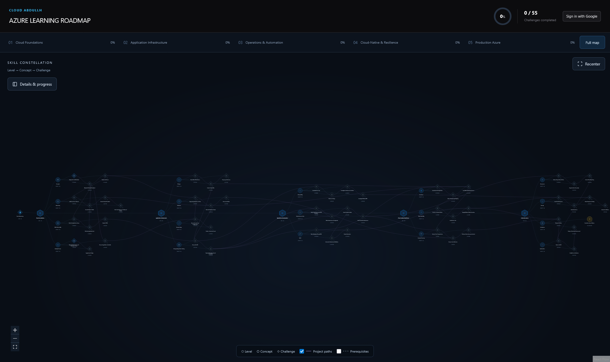

# Cloud Abdullh — Azure Learning Roadmap

An interactive skill-tree app for tracking your Azure cloud engineering journey across 55 project-based challenges.



## Stack

- **React + TypeScript** — UI
- **React Flow** — interactive skill constellation graph
- **Firebase** — auth & Firestore progress sync
- **Vite** — build tool

## Getting Started

```bash
npm install
npm run dev
```

Copy `.env.example` → `.env` and fill in your Firebase project config.

## Features

- 5 learning levels: Cloud Foundations → Production Azure
- Level → Concept → Challenge hierarchy
- Google sign-in with cross-device progress sync
- Smooth zoom-to-node on click
- Prerequisite & project-path edge overlays
